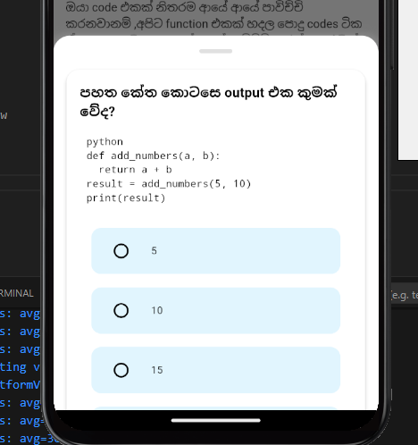

<!-- # Welcome to My Portfolio

[Your Name] is a software engineer with a degree in Software Engineering and expertise in full-stack development. Skilled in languages like Java, Python, and C++, [he/she/they] has experience building scalable, high-performance applications. With a strong background in cloud computing and DevOps, [Your Name] focuses on creating efficient, user-friendly solutions. Passionate about staying updated with the latest technology trends, [he/she/they] thrives in collaborative environments and is dedicated to driving innovation in every project.

## Skills
- JavaScript
- Python
- React -->

# Welcome to My Portfolio

<!-- Profile image with a rounded shape -->

[John Doe] is a software engineer with a degree in Software Engineering and expertise in full-stack development. Skilled in languages like Java, Python, and C++, he has experience building scalable, high-performance applications. With a strong background in cloud computing and DevOps, John focuses on creating efficient, user-friendly solutions. Passionate about staying updated with the latest technology trends, he thrives in collaborative environments and is dedicated to driving innovation in every project.

## Education

  

    <b>B.Sc.(Hons) in Software Engineering</b> 
    University of Plymouth Graduated with Second Class Upper Division, Aggregrate point : 65.56
  

  

    2021 Sep – 2024 Dec
  

  

    <b>Computer Hardware Technician NVQ Level 4</b> 
    Vocatioanl Training Center,Thirappane
  

  

    2018 Jan - 2019 May
  

  

    <b>GCE A/L</b> 
   
    Combined Maths S ,ICT C    
  

  

    2013 Jan - 2016 Aug 
  
  

  

    <b>GCE O/L</b> 
    Sinhala A , Buddhisam A , ICT B , Geography B, Maths B ,English C, Science C, History C
  

  

    2011 Jan - 2013 Dec
  

## Research

  

    <b>“Optimizing Machine Learning Models with Scalable Cloud Architecture”</b> 
    Published in <i>Journal of Advanced Computing</i> 
    Explored the integration of cloud services with machine learning models to enhance performance and scalability.
  

  

    2022
  

  

    <b>“AI-Powered Automation in Software Development”</b> 
    Conference Paper presented at the Global Software Engineering Symposium 
    Focused on how AI techniques can improve automation in testing, code review, and deployment pipelines.
  

  

    2021
  

## Working Experience

  

    <b>Trainee Software Engineer</b> 
    Bevylabs 
    - Designed and implemented full-stack applications using React, Node.js, and MongoDB. 
    - Collaborated with cross-functional teams to develop enterprise-level applications. 
    - Improved application performance by 30% by optimizing database queries and API endpoints.
  

  

    Sep 2024 – Present
  

  

    <b>Computer Hardware Technician</b> 
    Divitional Sectery Office ,Thirappane 
    - Assisted in the development of cloud-native applications using AWS. 
    - Worked on microservices architecture and containerized applications with Docker and Kubernetes. 
    - Implemented unit and integration testing for core modules, ensuring software reliability.
  

  

    Sep 2018 – Dec 2019
  

## Projects

   
  
         
    

      

        
        

          

            <b>CRUD Application Generator</b>
            
2022

          

          
Developed a full-stack e-commerce application using React for the frontend and Node.js for the backend.

        

      

    
     
    

      

        
        

          

            <b>IOT Automated Watering System</b>
            
2021

          

          
Built a real-time messaging application with WebSockets and React.

        

      

    
     
    

      

        
        

          

            <b>Lung Cancer Detection System</b>
            
2024

          

          
Final Year Individual Project

        

      

    
        
  
 

## Skills

  <!-- First Row -->
  

        

      <b>Programming Languages</b> 
      C, C#, Java
    

    

      <b>Mobile App Developing Tools</b> 
      Flutter
    

    

      <b>Web Development</b> 
      React, Node.js, HTML5, CSS3, Express, Javascript
    

    

      <b>Cloud Technologies</b> 
      AWS, Docker, Kubernetes
    

  

  <!-- Second Row -->
  

        

      <b>Database Management</b> 
      MongoDB, MySQL
    

    

      <b>Version Control</b> 
      Git, GitHub, Bitbucket
    

    

      <b>DevOps Tools</b> 
      Jenkins, Terraform, Ansible
    

    

      <!-- Empty card to maintain grid -->
    

  

## News

   
  
         
    

      

        
        

          <b>Programming Languages</b> 
          C, C#, Java
        

      

    
     
    

      

        
        

          <b>Mobile App Developing Tools</b> 
          Flutter
        

      

    
        
  
 

<!-- 
docsify serve -->
